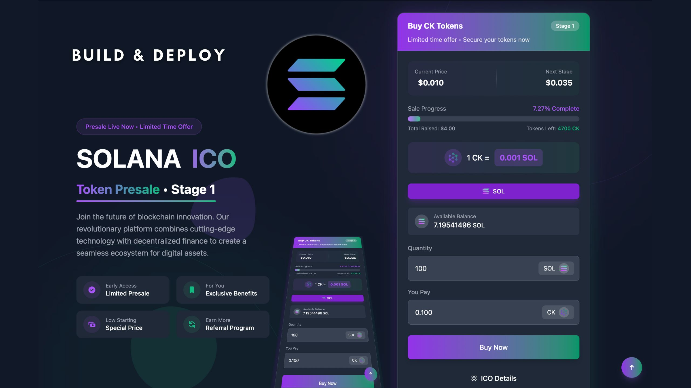

# Solana ICO PreSale DApp

This is a professional-grade Initial Coin Offering (ICO) PreSale Decentralized Application (DApp) built on the Solana blockchain. The project utilizes the Rust Anchor framework for smart contract development and Next.js for a modern, responsive frontend interface, providing a comprehensive solution for token presale events.

## Project Overview



This project implements complete ICO logic, including:
- **Token Management**: Fully compliant with Solana SPL Token standards.
- **Presale Phase Control**: Support for multiple sale stages and contribution logic.
- **Fund Contribution**: Seamless user participation via Phantom and other Solana-compatible wallets.
- **Web3 Integration**: Robust connection between the frontend and the on-chain smart contracts.

## Tech Stack

- **Smart Contracts**: Solana, Rust, Anchor Framework
- **Frontend**: Next.js, TailwindCSS
- **Wallet Support**: Phantom Wallet, Solana Wallet Adapter
- **Development Tools**: Web3.js, SPL Token SDK

## Getting Started

Follow these instructions to set up the project locally and install the necessary dependencies.

### Environment Requirements

#### Node.js & NPM
It is recommended to use the following versions or higher:
- **Node.js**: v18.17.1 or the latest stable version
- **NPM**: 8.19.2 or higher

#### Editor
- **VS Code**: Recommended with Solana-related extensions for an optimized development experience.

### Core Component Configuration

Before deployment, ensure you have configured the following services:

- **PINATA IPFS**: For storing token metadata.
  - [Pinata Cloud](https://pinata.cloud/)
- **ALCHEMY**: For Solana RPC node services.
  - [Alchemy](https://www.alchemy.com/)
- **PHANTOM**: Recommended Solana wallet.
  - [Phantom](https://phantom.com/)
- **SOLANA PLAYGROUND**: For rapid testing and deployment of smart contracts.
  - [Solana Playground](https://beta.solpg.io/)

## Development & Deployment

This project is currently in the development phase. You can customize the contract logic and frontend interface according to your specific requirements.

1. **Install Dependencies**:
   ```bash
   npm install
   ```

2. **Run Locally**:
   ```bash
   npm run dev
   ```

3. **Contract Deployment**:
   Deploy the contract to Devnet or Mainnet using the Anchor CLI or Solana Playground.

---

## Author

- **wls503pl** (Peile Wu)
- Email: peile.wu.1990@gmail.com
